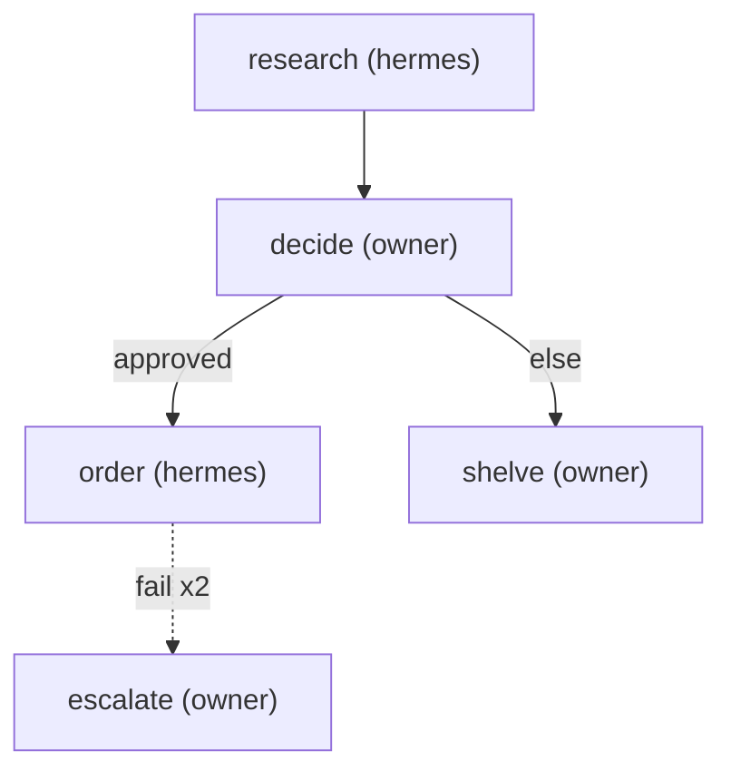

steps:
  - id: research
    assignee: hermes
    template: research-brief
    title: "Research {item} under {budget}"
  - id: decide
    assignee: owner                   # a human step = a plain task for you
    template: purchase-decision
    title: "Decide: buy {item}?"
    needs: [research]
    outcomes: [approved, rejected]
  - id: order                         # if …
    assignee: hermes
    title: "Order the chosen {item}"
    when: { step: decide, outcome: approved }
    on_fail: { retry: 2, then: escalate }
  - id: shelve                        # … else
    assignee: owner
    title: "Shelve the {item} purchase"
    else_of: decide
  - id: escalate
    assignee: owner
    title: "Ordering failed twice — take over"

Research an item within a budget, decide with a purchase-decision brief,
then either order it (with retries and a human escalation hatch) or
shelve the idea. The diagram below is generated — run `plt render
research-and-buy` after editing steps; never edit it by hand.

<!-- plt:mermaid -->

<!-- /plt:mermaid -->
