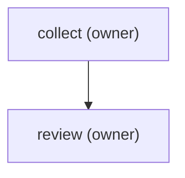

steps:
  - id: collect
    assignee: owner
    title: "Collect the week's notes"
    notes: "Gather the raw bullets — done items, half-thoughts, links, complaints — plus last week's 'Next week's focus' list."
  - id: review
    assignee: owner
    template: weekly-review
    title: "Write the weekly review"
    needs: [collect]

Owner-only two-step: collect the week's raw notes, then write the review
per the `weekly-review` template. The diagram below is generated — run
`plt render weekly-review-flow` after editing steps; never edit it by hand.

<!-- plt:mermaid -->

<!-- /plt:mermaid -->
