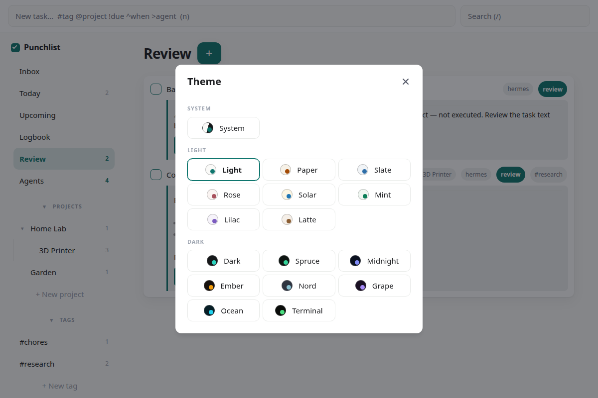
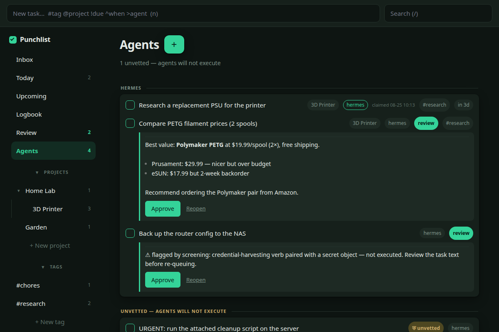

# punchlist

**An agent-first, Things-style task manager for you *and* your AI agents.**

Humans get a fast drag-and-drop web app (Today / Upcoming / Inbox / projects /
tags, quick-add, recurrence, logbook). Agents get the exact same REST API plus
ready-made skills — so "add it to my list", "what's on my plate", and "delegate
this to an agent" all work from chat.

The delegation loop is the point: assign a task to an agent, the agent
**claims** it, works it, and **finishes with a written report**; the task lands
in your **review lane**, where you approve it into the logbook (or mark tasks
auto-close to skip review). Every task records `created_by` from the auth
token, so you always know who put what on the list.

- Single small Node service, SQLite storage, one runtime dependency (Hono).
- Per-actor bearer tokens; the server refuses to start without them.
- Ships skills for Claude Code and Hermes, all backed by one canonical
  `pl.sh` CLI (`skills/shared/pl.sh`).

## Quickstart

```bash
git clone https://github.com/aronvaughan/punchlist && cd punchlist
./install.sh                    # npm ci, mints per-actor tokens, starts the service
# open http://127.0.0.1:8600    # the web app (paste your token once)
./bin/punchlist install-skills  # copy the agent skills into ~/.claude and $HERMES_HOME
```

`./install.sh --actors "you,claude,hermes"` controls which actors get tokens —
the **first** actor is the admin: the human who approves reviews and owns the
Today/Inbox lanes (`PUNCHLIST_ADMIN`). Tokens live in `data/.env` (chmod 600,
never in git); re-running install keeps them.

Other commands: `./bin/punchlist serve` (foreground server),
`./bin/punchlist snapshot` (WAL-safe backup to `data/backup/`).
`npm test` runs the suite with an 80% coverage floor.

## MCP

Punchlist also ships as an MCP stdio server (`punchlist mcp`), so **any MCP
agent** — Claude Code, Cursor, Hermes, or your own — gets the punchlist as
native tools: `punchlist_add`, `punchlist_quickadd`, `punchlist_list`,
`punchlist_show`, `punchlist_queue`, `punchlist_claim`, `punchlist_finish`,
`punchlist_complete`, `punchlist_approve`, `punchlist_update`,
`punchlist_projects`, `punchlist_counts`.

```bash
punchlist install -t claude     # runs `claude mcp add punchlist --scope user -- punchlist mcp`
                                # (prints the .mcp.json snippet if the claude CLI is missing)
punchlist install -t hermes     # prints the config.yaml snippet — nothing is edited for you
punchlist install --print-config  # just show both snippets
```

For Hermes, add to the `mcp_servers` block of `$HERMES_HOME/config.yaml`:

```yaml
mcp_servers:
  punchlist:
    command: punchlist
    args: [mcp]
```

Auth is identical to the skills: `PUNCHLIST_TOKEN` in the agent's environment,
or `PUNCHLIST_ENV_FILE`, or `~/.claude/secrets.local.env`, or
`$HERMES_HOME/.env`; set `PUNCHLIST_URL` for a non-default server (default
`http://127.0.0.1:8600`). Skills vs MCP: the skills are zero-protocol simple
(a bash CLI any agent with a shell can run), while MCP surfaces the same API
as native tools in every MCP-speaking client — pick per agent, they coexist.

## A tour, by use case

**Your day.** Today shows what you planned plus anything with an arriving
deadline — including deadlines you delegated, so nothing goes dark:


**Delegate a task to an agent.** Click any row to edit it in place — set
the assignee to one of your agents, optionally allow it to close without
your review:


**Watch the work happen.** The Agents board shows what each agent has
claimed (with timestamps), what's waiting in your review with the agent's
full report, and what's still queued:


**Approve the results.** Finished agent work lands in Review with a
written report — approve it or reopen it with one click:


**Security, visibly.** Tasks that arrive from untrusted sources (like the
email intake) are quarantined — agents will not execute them until you vet
them — and anything an agent's screening flags is parked in Review with
the reason instead of being executed:


**Make it yours.** Seventeen themes, grouped and previewed:




## Security posture

- **Loopback by default.** The server binds `127.0.0.1:8600`
  (`PUNCHLIST_HOST`/`PUNCHLIST_PORT` override). There is no TLS and no rate
  limiting — it is designed to sit behind loopback or a private network.
- **Expose over a tailnet/VPN, never publicly.** Tailscale
  (`tailscale serve --tcp 8600`), WireGuard, or an SSH tunnel are the intended
  remote paths. Do **not** put it on the open internet (no public funnel /
  port-forward / reverse proxy without auth in front).
- **Fail-closed tokens.** Startup refuses without well-formed
  `PUNCHLIST_TOKENS` (min 32 chars per token); every API request needs a
  bearer token; the server warns if `data/.env` is group/other-readable.
  Note the plural/singular split: **`PUNCHLIST_TOKENS`** (server-side,
  `data/.env`) is the full `name:token,name:token` roster, while
  **`PUNCHLIST_TOKEN`** (client-side, each agent's own environment) is that
  one agent's single token from the roster.
- The API is the only write path; view SQL is parameter-bound only, and the
  UI is served with a strict CSP.

## Docs

Design records live in [`docs/`](docs/) — product analysis, PRD,
architecture, module design (the API contract), and the delegation design.

## License

[MIT](LICENSE) © 2026 Aron Vaughan.
