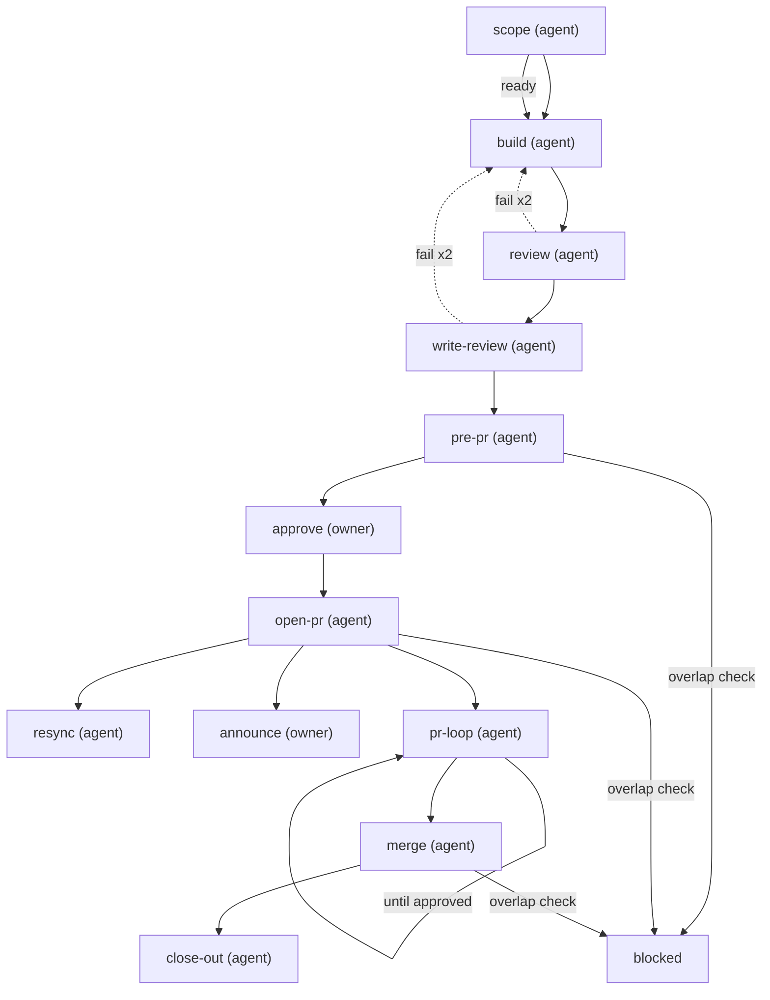

# Build and ship

One run per card. The agent builds and reviews; the owner approves the artifact and each reply; merge is automatic once GitHub says approved, green and resolved.

steps:
  - id: scope
    assignee: agent
    title: "Scope {card}"
    model: "{{config.models.default_model}}"
    reasoning: high
    skills: "{{config.skills.scope}}"
    artifact: dispatch-brief
    touches: declared
    jira:
      on_start: "{{config.jira.status.in_progress}}"
      sprint: active
    outcomes: [ready, needs_input]
  - id: build
    assignee: agent
    title: "Build {card}"
    needs: [scope]
    when: { step: scope, outcome: ready }
    model: "{{config.models.default_model}}"
    reasoning: high
    skills: "{{config.skills.build}}"
    tools: "{{config.tools.build}}"
  - id: review
    assignee: agent
    title: "Adversarial review of {card}"
    needs: [build]
    model: "{{config.models.review_model}}"
    reasoning: max
    agents: "{{config.review.panel_agents}}"
    gate:
      kind: adversarial
      mode: "{{config.review.panel_mode}}"
      agents: "{{config.review.panel_agents}}"
      quorum: all
      max_open_severity: low
      timeout: "{{config.gates.adversarial_timeout}}"
    outcomes: [pass, fail]
    on_fail: { retry: 2, then: build }
  - id: write-review
    assignee: agent
    title: "Writing review of the draft PR message and code comments for {card}"
    needs: [review]
    model: "{{config.models.review_model}}"
    agents: "{{config.review.writing_agents}}"
    gate:
      kind: adversarial
      mode: "{{config.review.writing_mode}}"
      agents: "{{config.review.writing_agents}}"
      quorum: all
    outcomes: [pass, fail]
    on_fail: { retry: 2, then: build }
  - id: pre-pr
    assignee: agent
    title: "Editable pre-PR summary for {card}, built from the reviewed text"
    needs: [write-review]
    skills: "{{config.skills.pre_pr}}"
    artifact: pre-pr-summary
    overlap: effort
  - id: approve
    assignee: owner
    title: "Approve the pre-PR artifact for {card}"
    needs: [pre-pr]
    gate:
      kind: human
      signal: artifact-approved
      by: owner
    reapprove:
      artifact: fix-summary
      rearm: [announce]
  - id: resync
    assignee: agent
    title: "Bring {card} up to date with main after a conflict"
    needs: [open-pr]
    arm_on: { gh: mergeStateStatus, equals: DIRTY }
    artifact: fix-summary
    banner: "🔀 MERGE CONFLICT — {card}"
    outcomes: [resynced]
  - id: reply
    assignee: owner
    title: "Approve each review reply for {card}"
    needs: [open-pr]
    manual: true
    gate:
      kind: human
      signal: reply-approved
      by: owner
  - id: announce
    assignee: owner
    title: "Ask the team for reviews on {card}"
    needs: [open-pr]
    manual: true
    banner: "📣 SLACK FOR REVIEWS — {card} · {pr_url}"
    outcomes: [done, skipped]
  - id: open-pr
    assignee: agent
    title: "Push and open the PR for {card}"
    needs: [approve]
    skills: "{{config.skills.ship}}"
    jira:
      on_done: "{{config.jira.status.in_review}}"
    verify:
      gh: [checks-green]
    overlap: effort
  - id: pr-loop
    assignee: agent
    title: "Work the review loop for {card}"
    needs: [open-pr]
    skills: "{{config.skills.pr_loop}}"
    agents: "{{config.review.writing_agents}}"
    gate:
      kind: human
      signal: reply-approved
      by: owner
    outcomes: [approved, changes_requested]
    repeat_until: approved
  - id: merge
    assignee: agent
    title: "Merge {card}"
    needs: [pr-loop]
    land_on: { gh: state, equals: MERGED }
    gate:
      kind: external
      checks: [approved_on_head, checks-green, threads_resolved]
    verify:
      gh: [merged]
    jira:
      on_done: "{{config.jira.status.done}}"
    overlap: effort
  - id: close-out
    assignee: agent
    title: "Close out {card}"
    needs: [merge]
    skills: "{{config.skills.close_out}}"
    outcomes: [done, suggest]

<!-- plt:mermaid -->

<!-- /plt:mermaid -->
