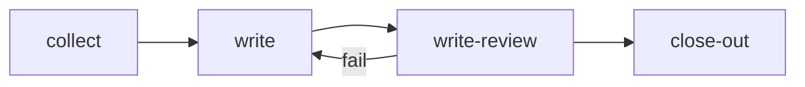

steps:
  - id: collect
    assignee: agent
    title: "Collect the digest for {date}"
    files: [digest-json]
    outcomes: [done]
  - id: write
    assignee: agent
    title: "Write the digest for {date}"
    needs: [collect]
  - id: write-review
    assignee: agent
    title: "Writing review for {date}"
    needs: [write]
    outcomes: [pass, fail]
    on_fail: { retry: 2, then: write }
  - id: close-out
    assignee: agent
    title: "Publish and close out the digest for {date}"
    needs: [write-review]
    files: [digest-md]
    outcomes: [done]

<!-- plt:mermaid -->

<!-- /plt:mermaid -->
