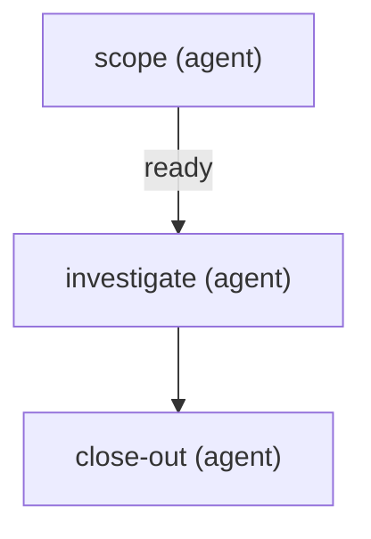

# Spike

One run, no PR. The agent investigates and writes a finding; close-out records it.

steps:
  - id: scope
    assignee: agent
    title: "Scope the spike {card}"
    model: "{{config.models.default_model}}"
    reasoning: high
    skills: "{{config.skills.scope}}"
    outcomes: [ready, needs_input]
  - id: investigate
    assignee: agent
    title: "Investigate {card}"
    needs: [scope]
    when: { step: scope, outcome: ready }
    model: "{{config.models.default_model}}"
    reasoning: high
  - id: close-out
    assignee: agent
    title: "Close out the spike {card}"
    needs: [investigate]
    outcomes: [done, suggest]

<!-- plt:mermaid -->

<!-- /plt:mermaid -->
