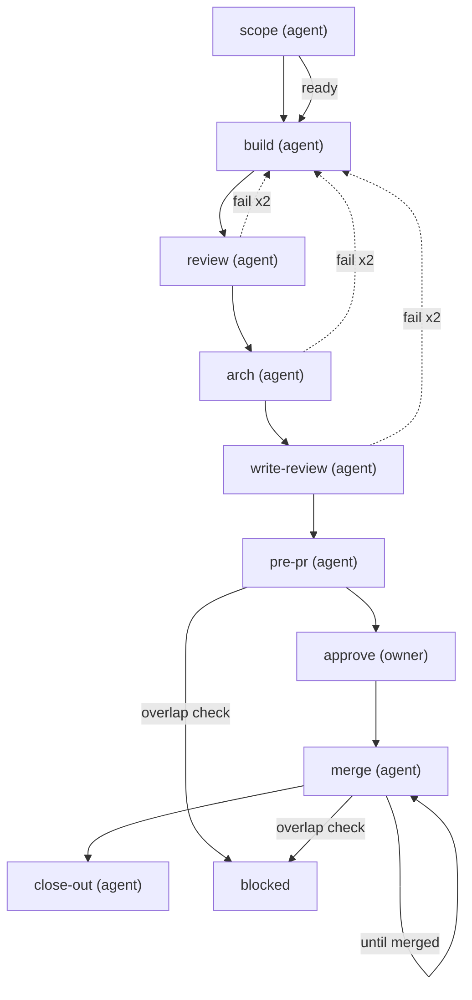

# Build and commit

The commit-review sibling of `build-and-ship`, identical up to `approve` but for one
added step: the architecture pass `build-and-ship` gets from `review-pr`, which this
cycle never runs. After it there
is no pull request, no review loop and no `gh` call. The agent fast-forwards the base
branch to the approved tip, then closes out.

Pick this cycle when a project reviews commits rather than pull requests. Set it with
`cycles.default` in project config, `cycle:` on a card, or `**Cycle:**` on a plan task.

One run per card. The agent builds and reviews; the owner approves the artifact; the approved diff is then fast-forwarded locally. No pull request, no review loop, no GitHub. A change after the approval — a rebase after a conflict at `merge`, or a fix the owner asks for on the page — re-enters at `approve`. It gets its own `fix-summary` page and a fresh owner approval before it lands; see the `reapprove` block on that step. The agent puts every human gate to the owner as a yes/no question and records the gate in the owner's name on "yes". The owner never types a `plt` command.

steps:
  - id: scope
    assignee: agent
    title: "Scope {card}"
    skills: "{{config.skills.scope}}"
    artifact: dispatch-brief
    touches: declared
    jira:
      on_start: "{{config.jira.status.in_progress}}"
    outcomes: [ready, needs_input]
  - id: build
    assignee: agent
    title: "Build {card}"
    needs: [scope]
    when: { step: scope, outcome: ready }
    skills: "{{config.skills.build}}"
    tools: "{{config.tools.build}}"
  - id: review
    assignee: agent
    title: "Adversarial review of {card}"
    needs: [build]
    agents: "{{config.review.panel_agents}}"
    gate:
      kind: adversarial
      mode: "{{config.review.panel_mode}}"
      agents: "{{config.review.panel_agents}}"
    outcomes: [pass, fail]
    on_fail: { retry: 2, then: build }
  # The architecture pass. `build-and-ship` reaches its arch adversary through `review-pr`,
  # which this cycle never runs — so without this step a project that reviews commits
  # would silently stop getting one. It sits AFTER the defect panel, not before it as
  # `review-pr`'s `gist` does: there the gist orients a reviewer arriving cold at someone
  # else's branch, whereas here the adversary already has the panel's findings and writes
  # straight into the `arch_gist` and `arch_questions` slots the owner reads at `pre-pr`.
  # `banner` for the same reason `plan_mode` is: a gate that fires before we know what it
  # flags gets overridden by habit, and an habitually overridden gate has stopped working.
  - id: arch
    assignee: agent
    title: "Architectural gist and open questions for {card}"
    notes: "Writes the `arch_gist` and `arch_questions` slots of the pre-commit summary. An empty `arch_questions` is a claim that none are open, not a slot left blank."
    needs: [review]
    agents: "{{config.review.arch_agents}}"
    gate:
      kind: adversarial
      mode: "{{config.review.arch_mode}}"
      agents: "{{config.review.arch_agents}}"
    outcomes: [pass, fail]
    on_fail: { retry: 2, then: build }
  # Differs from build-and-ship, which is why it sits outside the drift-guarded prefix:
  # there is no PR body to review here, so the title names the commit messages instead.
  # The step's mechanics are unchanged.
  - id: write-review
    assignee: agent
    title: "Writing review of the commit messages and code comments for {card}"
    notes: "Before the adversary reads the text, run `plt lint prose <file>` on it (long sentences, banned words, internal ticket keys in code comments, undefined acronyms — config.writing.*), fix every hit, then record `plt receipt --kind tool --name lint-prose`. A `banner` gate never holds this step: a failing reviewer is shown by prime as a warning."
    needs: [arch]
    agents: "{{config.review.writing_agents}}"
    gate:
      kind: adversarial
      mode: "{{config.review.writing_mode}}"
      agents: "{{config.review.writing_agents}}"
    outcomes: [pass, fail]
    on_fail: { retry: 2, then: build }
  # The id stays `pre-pr` on purpose. lib/spine.js keys two behaviours on this exact
  # string: `checkTouchesDrift` runs only when `stepId === 'pre-pr'`, and the
  # extrapolation writer records `step: 'pre-pr'`. A truer name such as `pre-commit`
  # switched the touches-drift check off for every card on this cycle, with no warning.
  # Do not rename it until spine.js keys on a step property instead. What the owner
  # sees is what changed: the title, and an artifact whose review surface is the
  # commits, in order.
  - id: pre-pr
    assignee: agent
    title: "Editable pre-commit summary for {card}, built from the reviewed text"
    needs: [write-review]
    skills: "{{config.skills.pre_pr}}"
    artifact: pre-commit-summary
    overlap: effort
  - id: approve
    assignee: owner
    title: "Approve the pre-commit artifact for {card}"
    needs: [pre-pr]
    gate:
      kind: human
      signal: artifact-approved
    # Follow-on branch. Every commit after this approval — a CI fix, a review fix — moves the tree,
    # which makes this gate stale, and the owner re-approves it. A re-approval is refused until the
    # change has its own page: a `fix-summary` artifact (editable template, one per fix; the same
    # URL is republished per fix) recorded at the new pin. What broke, the diff, the commit
    # message, the gates run. Then `plt gate approve <run> approve --by <owner>` and the fast-forward.
    reapprove:
      artifact: fix-summary
      # No `rearm` here, and that is the difference. In build-and-ship a follow-on push
      # dismisses the reviewers' GitHub approvals, so `announce` is re-armed. On a
      # commit-review project there is no reviewer state to dismiss and no announce step.
      # The stale gate is the whole mechanism: the approval is pinned to the tree, so a
      # moved tree re-asks by itself.
  # ---- commit review, no PR -------------------------------------------------
  # Same shape as build-and-ship up to `approve`; after it the diff is read on the
  # COMMITS and the merge is a local fast-forward. A project on this cycle has no
  # `gh pr create` or `gh pr merge` to gate, which narrows the brain's autonomy
  # envelope correctly: those commands cannot occur, so they need no rule.
  #
  # What this does NOT change: `approve` is still a human gate. Reviewing commits
  # instead of a PR changes WHERE the diff is read, never WHETHER a person reads it.
  # The id stays `merge` on purpose. `spine.gateCheck` runs its base-freshness check only
  # when the step id is in `['open-pr','merge']`; a step named `commit` would get no
  # "branch base is behind origin/main — rebase, then re-pin" signal. It is a merge (a
  # local fast-forward), so it takes the name. `approve` is still a human gate: reviewing
  # commits changes where the diff is read, not whether a person reads it.
  - id: merge
    assignee: agent
    title: "Land {card} on the base branch by fast-forward"
    needs: [approve]
    skills: "{{config.skills.ship}}"
    jira:
      on_done: "{{config.jira.status.done}}"
    # Dropping the PR does not drop the collision: two efforts can still touch one
    # repo and meet at the fast-forward. `conflict` is an OUTCOME, not a
    # failure, so on_fail does not fire; the next command is
    # `plt card rebase <effort>/<n>` and the step repeats.
    outcomes: [merged, conflict]
    repeat_until: merged
    overlap: effort
  - id: close-out
    assignee: agent
    title: "Close out {card}"
    needs: [merge]
    skills: "{{config.skills.close_out}}"
    notes: "Part of the landing sequence: harvest, boards, run page, effort index, then `plt run close` — unprompted. The run is not done until the index says closed."
    outcomes: [done, suggest]
<!-- plt:mermaid -->

<!-- /plt:mermaid -->
