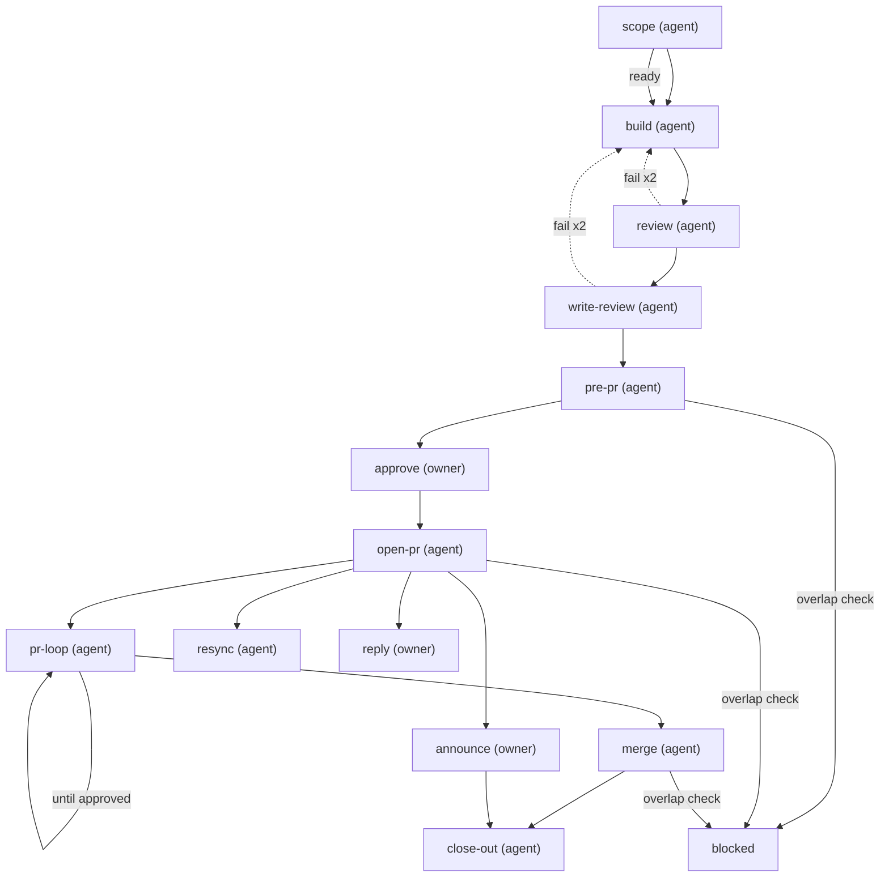

# Build and ship

One run per card. The agent builds and reviews; the owner approves the artifact and each reply; merge is automatic once GitHub says approved, green and resolved. A change after the approval (a CI fix, a review fix, a merge of main) re-enters at `approve`: it gets its own `fix-summary` page and a fresh owner approval before it is committed — see the `reapprove` block on that step. Every human gate is put to the owner as a yes/no question by the agent, which records the gate in the owner's name on "yes"; the owner never types a `plt` command.

steps:
  - id: scope
    assignee: agent
    title: "Scope {card}"
    model: "{{config.models.default_model}}"
    reasoning: high
    skills: "{{config.skills.scope}}"
    artifact: dispatch-brief
    touches: declared
    jira:
      on_start: "{{config.jira.status.in_progress}}"
      sprint: active
    outcomes: [ready, needs_input]
  - id: build
    assignee: agent
    title: "Build {card}"
    needs: [scope]
    when: { step: scope, outcome: ready }
    model: "{{config.models.default_model}}"
    reasoning: high
    skills: "{{config.skills.build}}"
    tools: "{{config.tools.build}}"
  - id: review
    assignee: agent
    title: "Adversarial review of {card}"
    needs: [build]
    model: "{{config.models.review_model}}"
    reasoning: max
    agents: "{{config.review.panel_agents}}"
    gate:
      kind: adversarial
      mode: "{{config.review.panel_mode}}"
      agents: "{{config.review.panel_agents}}"
      quorum: all
      max_open_severity: low
      timeout: "{{config.gates.adversarial_timeout}}"
    outcomes: [pass, fail]
    on_fail: { retry: 2, then: build }
  - id: write-review
    assignee: agent
    title: "Writing review of the draft PR message and code comments for {card}"
    notes: "Before the adversary reads the text, run `plt lint prose <file>` on it (long sentences, banned words, internal ticket keys in code comments, undefined acronyms — config.writing.*), fix every hit, then record `plt receipt --kind tool --name lint-prose`. A `banner` gate never holds this step: a failing reviewer is shown by prime as a warning."
    needs: [review]
    model: "{{config.models.review_model}}"
    agents: "{{config.review.writing_agents}}"
    gate:
      kind: adversarial
      mode: "{{config.review.writing_mode}}"
      agents: "{{config.review.writing_agents}}"
      quorum: all
    outcomes: [pass, fail]
    on_fail: { retry: 2, then: build }
  - id: pre-pr
    assignee: agent
    title: "Editable pre-PR summary for {card}, built from the reviewed text"
    needs: [write-review]
    skills: "{{config.skills.pre_pr}}"
    artifact: pre-pr-summary
    overlap: effort
  - id: approve
    assignee: owner
    title: "Approve the pre-PR artifact for {card}"
    needs: [pre-pr]
    gate:
      kind: human
      signal: artifact-approved
      by: owner
    # Follow-on branch. Every commit after this approval — a CI fix, a review fix — moves the tree,
    # which makes this gate stale, and the owner re-approves it. A re-approval is refused until the
    # change has its own page: a `fix-summary` artifact (editable template, one per fix; the same
    # URL is republished per fix) recorded at the new pin. What broke, the diff, the commit
    # message, the gates run. Then `plt gate approve <run> approve --by <owner>` and the commit.
    reapprove:
      artifact: fix-summary
      # A push after the reviewers approved dismisses their approvals (dismiss_stale_reviews). The
      # agent posts one PR comment naming the change and re-requests every dismissed reviewer; the
      # owner's announce step comes back so the Slack banner asks for the re-approval too.
      rearm: [announce]
  - id: open-pr
    assignee: agent
    title: "Push and open the PR for {card}"
    needs: [approve]
    skills: "{{config.skills.ship}}"
    jira:
      on_done: "{{config.jira.status.in_review}}"
    verify:
      gh: [checks-green]
    overlap: effort
  - id: pr-loop
    assignee: agent
    title: "Work the review loop for {card}"
    needs: [open-pr]
    skills: "{{config.skills.pr_loop}}"
    # Each review round gets a review-response page (editable template): what came in, one reply per
    # thread exactly as it will be posted. The owner edits and Saves; nothing is posted before it.
    artifact: review-response
    gate:
      kind: external
      checks: [review_approved]
    outcomes: [approved, changes_requested]
    repeat_until: approved
  # Merge-conflict path. Armed by `plt run poll` when GitHub reports the branch DIRTY (main moved
  # under the PR), disarmed when it is clean again. The work is fixed: merge origin/main into the
  # branch (never rebase or force-push), resolve, run the gates, publish the fix-summary page, take
  # the owner's yes/no, commit and push; the push dismisses the reviewers' approvals, so post one PR
  # comment naming the change, re-request the dismissed reviewers, and announce re-arms for Slack.
  - id: resync
    assignee: agent
    title: "Bring {card} up to date with main after a conflict"
    needs: [open-pr]
    arm_on: { gh: mergeStateStatus, equals: DIRTY }
    skills: "{{config.skills.ship}}"
    artifact: fix-summary
    banner: "🔀 MERGE CONFLICT — {card} · {pr_url} is DIRTY against main.\nThe agent merges main, resolves, runs the gates and publishes the fix page; you approve with a yes/no. The push will dismiss the reviewers' approvals."
    outcomes: [resynced]
  - id: reply
    assignee: owner
    title: "Approve each review reply for {card}"
    needs: [open-pr]
    manual: true
    gate:
      kind: human
      signal: reply-approved
      by: owner
  # Parallel owner step: does not block pr-loop or merge, but close-out waits for it. The banner is
  # shown by prime, on every prompt and at every stop until the owner passes the gate — by running
  # the command, or by telling the agent "slacked it" (the agent then runs it in the owner's name).
  - id: announce
    assignee: owner
    title: "Ask the team for reviews on {card}"
    needs: [open-pr]
    manual: true
    # Banner mode (D-003, amended 2026-09-16): a reminder, not a gate. The banner shows on every prompt
    # and stop until the step is done; the owner's "slacked it" is recorded by the agent as a note
    # receipt and the step finishes. Nothing downstream waits on it except close-out.
    banner: "📣 SLACK FOR REVIEWS — {card} · the PR needs reviewers (first review, or a re-approval after a push).\nPaste in the team channel, plain text: the PR link {pr_url}, the card link {card_url}, one sentence on what it does or what changed.\nThen tell the agent: slacked it   (it records the note and finishes this step)"
    outcomes: [done, skipped]
  # Landing sequence. There is no human gate after the review approves: the
  # merge is the queue's, and everything from `merged` to `plt run close` is the agent's, run in one
  # pass the moment `plt run poll` (or the watcher's cycle) sees the PR merged — never waiting for
  # the owner to say "finish merge", "update the index", "close the run". The pass is fixed:
  #   1. `plt run poll` does this itself (`land_on`): gh receipts merged/approved_on_head/checks-green/
  #      threads_resolved · jira on_done via config.jira.script (card → Done) · finish merge · close-out ready
  #   2. `plt step start close-out`
  #   3. harvest (config.skills.close_out) · boards (pr-watch entry → archive, status board)
  #   4. render + publish the run page and the effort index; artifact receipts for both
  #   5. `plt step finish close-out --outcome done` · `plt run close {run} --by {owner}`
  # The owner is told once, at the end, with the index link. If a step in the pass fails, block
  # with the question; do not stop and wait for a prod.
  - id: merge
    assignee: agent
    title: "Merge {card}"
    needs: [pr-loop]
    land_on: { gh: state, equals: MERGED }
    notes: "No ask here. When the PR is merged, run the landing sequence above through close-out and run close in one pass; report once at the end."
    gate:
      kind: external
      checks: [approved_on_head, checks-green, threads_resolved]
    verify:
      gh: [merged]
    jira:
      on_done: "{{config.jira.status.done}}"
    overlap: effort
  - id: close-out
    assignee: agent
    title: "Close out {card}"
    needs: [merge, announce]
    skills: "{{config.skills.close_out}}"
    notes: "Part of the landing sequence: harvest, boards, run page, effort index, then `plt run close` — unprompted. The run is not done until the index says closed."
    outcomes: [done, suggest]

<!-- plt:mermaid -->

<!-- /plt:mermaid -->
