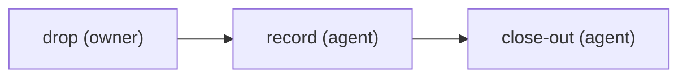

# Discard

An exit, not a cycle. A run on any cycle can end here: `plt run discard <id> --by <owner> --reason "…" [--replaced-by <card>]` is the owner's gate. It retires every unfinished step of the running cycle, appends these steps to the run, and records the decision in the owner's name — that is the `drop` step passing. From there the agent walks `record` and `close-out` like any other step, receipts and all, and `plt run close` marks the run closed as discarded. A discarded run never satisfies another card's `after:` dependency; the effort file's `dropped:` list is what the planner reads.

steps:
  - id: drop
    assignee: owner
    title: "Decide to drop {card}"
    gate:
      kind: human
      signal: run-discarded
  - id: record
    assignee: agent
    title: "Record the drop of {card} on the tracker and the effort"
    needs: [drop]
    skills: "{{config.skills.discard}}"
    jira:
      on_done: "{{config.jira.status.discarded}}"
    # The effort file must list the card under `dropped:` (an id, or `{ id, reason, replaced_by }`)
    # before this step can finish — checked live against the file, not from a receipt.
    effort: dropped
    # The outcome states what became of the branch. `worktree_removed` is verified: the finish is
    # refused while the run's repo_dir still exists on disk.
    outcomes: [worktree_kept, worktree_removed]
  - id: close-out
    assignee: agent
    title: "Close out the drop of {card}"
    needs: [record]
    outcomes: [done]

<!-- plt:mermaid -->

<!-- /plt:mermaid -->
