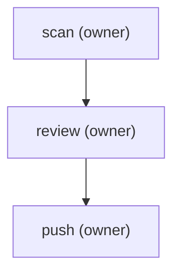

steps:
  - id: scan
    assignee: owner
    template: repo-leak-scan
    title: "Leak-scan the repo (secrets + PII, full history)"
    notes: "Run av-repo-leak-scan <repo> --fetch. Must come back CLEAN (or every finding explained as intentional) before continuing. SECRET findings in history = rotate now."
  - id: review
    assignee: owner
    template: pre-push-review
    title: "Generate + publish the pre-push review"
    needs: [scan]
    notes: "Run av-prepush-review: build the page from git, hand-write the summary + a worked example, publish, and post the link here."
  - id: push
    assignee: owner
    title: "Push (after clean scan + approved review)"
    needs: [review]
    notes: "Ask-gated. Only after the scan is clean and the review is approved. Never force-push shared branches."

The pre-push process for a public repo, as three gated steps: **scan** for
leaked secrets/PII across the full history, **review** the exact diff a push
would send (published as a shareable page), then **push**. Each step needs
the one before it; the push waits on an approved review, which waits on a
clean scan. Launch with `plt launch pre-push --input repo=<name> base=<ref>`.
The diagram is generated — run `plt render pre-push` after editing steps;
never edit it by hand.

<!-- plt:mermaid -->

<!-- /plt:mermaid -->
