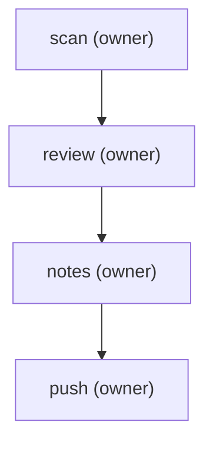

steps:
  - id: scan
    assignee: owner
    template: repo-leak-scan
    title: "Leak-scan the repo (secrets + PII, full history)"
    notes: "Run av-repo-leak-scan <repo> --fetch. Must come back CLEAN (or every finding explained as intentional) before continuing. SECRET findings in history = rotate now."
  - id: review
    assignee: owner
    template: pre-push-review
    title: "Generate + publish the pre-push review"
    needs: [scan]
    notes: "Run av-prepush-review: build the page from git, hand-write the summary + a worked example, publish, and post the link here."
  - id: notes
    assignee: owner
    template: release-notes
    title: "Release notes (if this push cuts a new version)"
    needs: [review]
    notes: "If the push bumps the version: draft docs/releases/vX.Y.Z.md with av-release-notes from the previous tag, fill highlights/breaking/known-issues, bump package.json to match, and link it in docs/releases/README.md. If no version change, mark this step done immediately."
  - id: push
    assignee: owner
    title: "Push (after clean scan + approved review + notes)"
    needs: [notes]
    notes: "Ask-gated. Only after a clean scan, an approved review, and (for a version bump) written notes. Push commits, then cut the release: git tag v<version> MATCHING package.json (== the npm version), `gh release create v<version> -F docs/releases/v<version>.md` (add --prerelease for a candidate), and `npm publish` (--tag next for a candidate so latest is untouched). The git tag, GitHub Release, and npm version must all be the same string. Never force-push shared branches."

The pre-push process for a public repo, as four gated steps: **scan** for
leaked secrets/PII across the full history, **review** the exact diff a push
would send (published as a shareable page), draft **release notes** if the
push cuts a new version, then **push**. Each step needs the one before it; the
push waits on notes, which wait on an approved review, which waits on a clean
scan. Launch with `plt launch pre-push --input repo=<name> base=<ref>`.
The diagram is generated — run `plt render pre-push` after editing steps;
never edit it by hand.

<!-- plt:mermaid -->

<!-- /plt:mermaid -->
