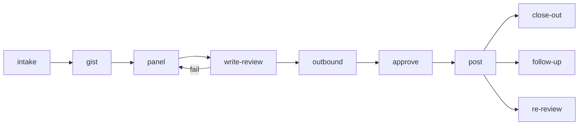

# Review a pull request

One run per inbound PR (run id = `PR-<number>`). The goal is "our review is posted and followed up", never "merged": the agent never pushes to, fixes, or merges someone else's branch. The owner's edits on the outbound page are final; the only human gate is posting (`reply-approved`), for the first review and for every later reply.

steps:
  - id: intake
    assignee: agent
    title: "Intake {pr}: facts, base branch, stack position, add us as reviewer"
    model: "{{config.models.default_model}}"
    verify:
      gh: [pr-facts]
    outcomes: [ready, skip]
  - id: gist
    assignee: agent
    title: "Architectural gist of {pr}"
    needs: [intake]
    when: { step: intake, outcome: ready }
    model: "{{config.models.review_model}}"
    reasoning: high
    agents: "{{config.review.arch_agents}}"
  - id: panel
    assignee: agent
    title: "Adversarial defect panel on {pr}"
    needs: [gist]
    model: "{{config.models.review_model}}"
    reasoning: max
    agents: "{{config.review.panel_agents}}"
    gate:
      kind: adversarial
      mode: "{{config.review.panel_mode}}"
      agents: "{{config.review.panel_agents}}"
      quorum: all
      timeout: "{{config.gates.adversarial_timeout}}"
    outcomes: [pass, fail]
  - id: write-review
    assignee: agent
    title: "Writing review of the draft comments and summary for {pr}"
    notes: "Before the adversary reads the text, run `plt lint prose <file>` on it (long sentences, banned words, internal ticket keys in code comments, undefined acronyms — config.writing.*), fix every hit, then record `plt receipt --kind tool --name lint-prose`. A `banner` gate never holds this step: a failing reviewer is shown by prime as a warning."
    needs: [panel]
    model: "{{config.models.review_model}}"
    agents: "{{config.review.writing_agents}}"
    gate:
      kind: adversarial
      mode: "{{config.review.writing_mode}}"
      agents: "{{config.review.writing_agents}}"
      quorum: all
    outcomes: [pass, fail]
    on_fail: { retry: 2, then: panel }
  - id: outbound
    assignee: agent
    title: "Editable outbound review page for {pr}, built from the reviewed text"
    needs: [write-review]
    artifact: review-outbound
  - id: approve
    assignee: owner
    title: "Approve the review to post on {pr}"
    needs: [outbound]
    gate:
      kind: human
      signal: reply-approved
      by: owner
  - id: post
    assignee: agent
    title: "Post the approved review on {pr}"
    needs: [approve]
    verify:
      gh: [review-posted]
    outcomes: [posted, skipped]
  # Armed by `plt run poll` when the author (or any non-bot reviewer other than us) writes after our
  # review — an issue comment, a reply in one of our threads, or a review of their own. Disarmed when
  # nothing new. Never a standing "needs you": with no reply there is nothing to approve.
  - id: follow-up
    assignee: owner
    title: "Approve each follow-up reply on {pr}"
    needs: [post]
    arm_on: { gh: authorRepliedSinceOurReview, equals: true }
    waiting: "the author to reply to our review"
    notes: "VERIFICATION ONLY — the goal is to confirm the author remediated what we raised, not to find new issues. For each thread we opened: read the reply, check the claimed commit is on the PR and the code/test does what the reply says (or the deferral ticket exists), verdict verified / verified-deferred / not-as-described / disagree, one-line reply. Build the follow-up page (what we asked · what he replied · verdict · editable reply) for the owner; on their yes post the replies into the threads, resolve them, and submit the review (approve when every thread is verified or verified-deferred)."
    artifact: review-followup
    gate:
      kind: human
      signal: reply-approved
      by: owner
  # Armed when the head moved after our review (rebase, new commits). The agent re-runs the
  # carry-forward check against the new head and refreshes the outbound page; posting again is the
  # same reply-approved gate.
  - id: re-review
    assignee: agent
    title: "Re-check our review of {pr} against the moved head"
    needs: [post]
    arm_on: { gh: headMovedSinceOurReview, equals: true }
    waiting: "the branch to move under our review"
    notes: "Carry-forward, not a new review: for each finding we posted, decide applies (new path:line inside the current diff) / resolved / moot at the new head, with evidence. Do not hunt for new issues. If the owner has not yet posted, rebuild the outbound page from the carry-forward; if they have, this feeds the follow-up verdicts."
    outcomes: [still-applies, refreshed]
  # Our approval is a live fact, not a step or a run status. `plt run poll` derives it from the review
  # list (`ourApprovalStanding` — our latest verdict review is APPROVED — plus `ourApprovalSha`,
  # `ourApprovalOnHead`, `ourApprovalDismissed`) and keeps it in `state.poll.facts`; a repo with
  # dismiss-stale-reviews withdraws it on the author's next push, which is why no step records it.
  # The index renders an approved-and-waiting run as "Approved by us on <sha> · waiting on the
  # author to merge"; follow-up and re-review still arm on a later reply or push exactly as above.
  # Armed by `plt run poll` only once the PR is merged or closed; until then it is a wait, not a step.
  - id: close-out
    assignee: agent
    title: "Close the review of {pr} once it lands or is withdrawn"
    needs: [post]
    arm_on: { gh: prClosed, equals: true }
    waiting: "the PR to merge or close"
    gate:
      kind: external
      checks: [pr_closed]
    skills: "{{config.skills.close_out}}"
    outcomes: [done, suggest]

<!-- plt:mermaid -->

