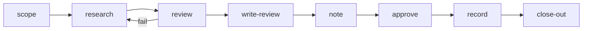

# Spike

One run per question. No branch, no PR: the deliverable is a note the owner approves and a decision recorded on the effort. The owner's edits on the note are final.

steps:
  - id: scope
    assignee: agent
    title: "Frame the question for {card}"
    skills: "{{config.skills.scope}}"
    artifact: dispatch-brief
    jira:
      on_start: "{{config.jira.status.in_progress}}"
    outcomes: [ready, needs_input]
  - id: research
    assignee: agent
    title: "Research {card}"
    needs: [scope]
    when: { step: scope, outcome: ready }
    tools: "{{config.tools.research}}"
  - id: review
    assignee: agent
    title: "Adversarial review of the findings for {card}"
    needs: [research]
    agents: "{{config.review.spike_agents}}"
    gate:
      kind: adversarial
      mode: "{{config.review.panel_mode}}"
      agents: "{{config.review.spike_agents}}"
    outcomes: [pass, fail]
    on_fail: { retry: 2, then: research }
  - id: write-review
    assignee: agent
    title: "Writing review of the draft spike note for {card}"
    notes: "Before the adversary reads the text, run `plt lint prose <file>` on it (long sentences, banned words, internal ticket keys in code comments, undefined acronyms — config.writing.*), fix every hit, then record `plt receipt --kind tool --name lint-prose`. A `banner` gate never holds this step: a failing reviewer is shown by prime as a warning."
    needs: [review]
    agents: "{{config.review.writing_agents}}"
    gate:
      kind: adversarial
      mode: "{{config.review.writing_mode}}"
      agents: "{{config.review.writing_agents}}"
    outcomes: [pass, fail]
    on_fail: { retry: 2, then: research }
  - id: note
    assignee: agent
    title: "Editable spike note for {card}, built from the reviewed text"
    needs: [write-review]
    artifact: spike-note
  - id: approve
    assignee: owner
    title: "Approve the spike note for {card}"
    needs: [note]
    gate:
      kind: human
      signal: artifact-approved
  - id: record
    assignee: agent
    title: "Record the decision for {card}"
    needs: [approve]
    jira:
      on_done: "{{config.jira.status.done}}"
    outcomes: [decided, needs_input]
  - id: close-out
    assignee: agent
    title: "Close out {card}"
    needs: [record]
    skills: "{{config.skills.close_out}}"
    outcomes: [done, suggest]

<!-- plt:mermaid -->

